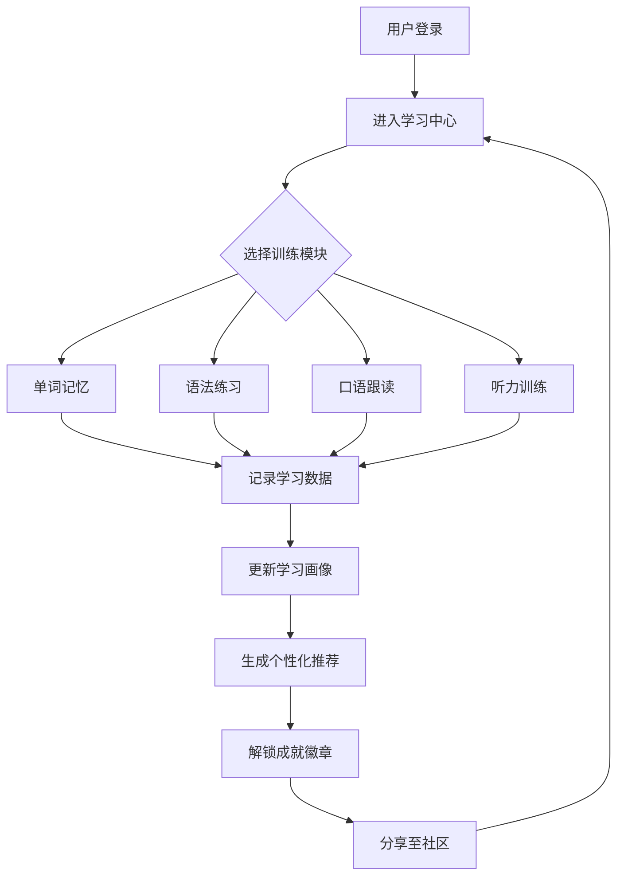

# 多语种在线教育平台 - 产品需求文档（PRD）

## 1. 产品概述

**LinguaVerse（语元）** 是一款面向全球语言学习者的沉浸式多语种在线教育平台，主打"母语化语境 + 游戏化激励"双核驱动的学习体验。
平台覆盖英语、日语、韩语三大主流语种，提供从 A1 到 C2 的全级别课程体系与四大核心训练模块（单词记忆 / 语法练习 / 口语跟读 / 听力训练），通过 AI 驱动的个性化学习路径与社区激励机制，帮助学习者构建从输入到输出的完整语言能力闭环。

**目标用户**：18-35 岁具备一定数字素养、追求高效沉浸式学习体验的成年语言学习者；语言留学预备人群；兴趣型学习者与文化爱好者。

**市场价值**：解决传统语言学习应用"学完即忘、缺乏语境、动力不足"三大痛点，差异化优势在于真实语料场景 + AI 个性化推荐 + 强社交激励生态。

---

## 2. 核心功能

### 2.1 用户角色

| 角色 | 注册方式 | 核心权限 |
|------|----------|----------|
| 访客游客 | 无需注册 | 浏览首页、试学 1 节体验课、查看公开社区内容 |
| 正式学员 | 邮箱/手机号 + 密码 | 学习全部课程、参与社区、记录进度、获得成就 |
| 学习达人 | 学员自动晋升 | 解锁达人徽章、可发布学习笔记与组织小组 |
| 内容创作者 | 学员申请审核 | 制作并发布课程、获得打赏与分成 |

### 2.2 功能模块

1. **首页门户**：英雄区、语种入口、热门课程推荐、学习仪表盘预览、限时挑战、社区动态流
2. **课程中心**：分级课程体系（CEFR A1-C2 / JLPT N5-N1 / TOPIK 1-6）、课程详情、章节试学
3. **学习中心**：单词记忆、语法练习、口语跟读、听力训练四大训练模块
4. **学习仪表盘**：每日打卡、连胜日历、学习时长统计、能力雷达图、错题本
5. **个性化推荐**：基于学习画像与目标推荐的每日学习路径
6. **社区交流**：动态发布、话题广场、学习小组、私信互动
7. **成就激励**：徽章系统、积分商城、排行榜、每日任务、连胜奖励
8. **个人中心**：资料设置、订阅管理、学习报告、消息中心
9. **登录注册**：邮箱注册、手机号注册、第三方登录（模拟）

### 2.3 页面详情

| 页面名称 | 模块名称 | 功能描述 |
|---------|---------|----------|
| 首页 | 英雄区 | 滚动标语、CTA 按钮、动态语种字符背景 |
| 首页 | 语种入口 | 三大语种入口卡片（英/日/韩），展示学习人数与等级 |
| 首页 | 热门课程 | 横向滚动课程卡，显示评分与学习人数 |
| 首页 | 每日挑战 | 今日任务卡片，含倒计时与奖励 |
| 首页 | 社区动态 | 学员学习成果与问题动态流 |
| 课程中心 | 课程列表 | 筛选器（语种、等级、类型），课程网格 |
| 课程详情 | 课程概览 | 课程简介、大纲、导师信息、学员评价 |
| 课程详情 | 章节列表 | 章节展开/折叠、试学按钮、进度条 |
| 学习中心 | 单词记忆 | 闪卡模式、拼写测试、记忆曲线复习 |
| 学习中心 | 语法练习 | 选择题 / 填空题 / 排序题，AI 错题解析 |
| 学习中心 | 口语跟读 | 原音播放、跟读录音、AI 评分波形对比 |
| 学习中心 | 听力训练 | 多档语速、听写填空、听后选择 |
| 学习仪表盘 | 数据看板 | 学习时长、能力雷达、连胜日历 |
| 学习仪表盘 | 每日任务 | 任务列表、进度条、奖励预览 |
| 个性化推荐 | 学习路径 | 每日推荐学习计划，可一键开练 |
| 社区 | 动态广场 | 学员动态瀑布流，支持点赞评论 |
| 社区 | 学习小组 | 兴趣小组列表，活跃度排行 |
| 社区 | 话题详情 | 帖子正文、评论区、相关课程推荐 |
| 成就中心 | 徽章墙 | 已获得/未解锁徽章展示 |
| 成就中心 | 排行榜 | 周榜/月榜/总榜，多语种分组 |
| 个人中心 | 资料设置 | 头像、昵称、学习目标、目标语种 |
| 个人中心 | 学习报告 | 周报/月报可视化 |
| 登录注册 | 登录页 | 邮箱+密码、模拟第三方登录、忘记密码 |
| 登录注册 | 注册页 | 邮箱+密码+目标语种选择 |

---

## 3. 核心流程

### 3.1 用户主流程

访客从首页进入 → 浏览语种与课程 → 试学体验课 → 引导注册 → 选择目标语种与等级 → 进入学习中心开始训练 → 完成每日任务获得奖励 → 参与社区分享成果 → 解锁成就 → 持续学习形成习惯闭环。

### 3.2 学习闭环流程

---

## 4. 用户界面设计

### 4.1 设计风格

- **主题色**：深墨黑 `#0B0B0F` + 米白 `#F4F1EA` 主基色
- **辅助色**：
  - 樱粉 `#FF6B9D`（日语文化点缀）
  - 翡翠青 `#10B981`（正向进度 / 成就）
  - 琥珀金 `#F59E0B`（学习 / 升级）
  - 电光蓝 `#3B82F6`（英语 / 链接）
  - 朱砂红 `#EF4444`（韩语 / 警告）
- **强调色**：高饱和的霓虹强调 `linear-gradient(135deg, #FF6B9D 0%, #F59E0B 100%)`
- **按钮风格**：圆角胶囊（`rounded-full`）与硬朗切角矩形混搭，主按钮带微妙阴影与按下位移
- **字体方案**：
  - 展示字体：`Fraunces`（衬线、富有书卷气）
  - 正文字体：`Noto Sans SC` + `Inter`
  - 强调字符：`Noto Serif JP`（日文）、`Noto Serif KR`（韩文）作为语种符号点缀
- **布局风格**：12 栅格 + 不对称破局，大留白与密集信息卡交替
- **图标风格**：Lucide 线性图标 + 少量自绘 SVG 文化符号（樱花/太极/韩文方块）
- **动效**：滚动进入视口 staggered reveal；hover 微缩放；切换模块使用 Shared Layout 风格过渡

### 4.2 页面设计概览

| 页面 | 模块 | UI 元素 |
|------|------|---------|
| 首页 | 英雄区 | 巨幅衬线标题 + 滚动字符 + 霓虹渐变 CTA |
| 首页 | 语种入口 | 3 卡片横向，每卡专属主题色与文化符号 |
| 首页 | 热门课程 | 卡片 16:9 封面 + 评分 + 学习人数 + 难度标签 |
| 课程中心 | 课程列表 | 左侧筛选侧栏 + 右侧网格，顶部排序 |
| 课程详情 | 课程概览 | 顶部 16:5 封面 + 元信息胶囊 + 大纲折叠列表 |
| 学习中心 | 单词记忆 | 居中闪卡 + 翻转动画 + 进度条 |
| 学习中心 | 口语跟读 | 录音波形 + 原音波形叠加 + 评分环 |
| 学习仪表盘 | 能力雷达 | 6 维雷达图 + 等级分 |
| 仪表盘 | 连胜日历 | 7xN 热力图日历 |
| 社区 | 动态广场 | 信息流卡片 + 头像 + 操作栏 |
| 成就中心 | 徽章墙 | 六角形 / 圆形徽章网格 + 进度环 |
| 登录注册 | 表单 | 居中卡片 + 大标题 + 步骤引导 |

### 4.3 响应式

桌面端优先（≥1280px 主设计），向下兼容至 1024px 笔记本、768px 平板、375px 移动端。导航在 <768px 折叠为底部 Tab Bar。触摸目标 ≥44px。

### 4.4 视觉细节

- 全站加入细颗粒度噪点纹理（`background-image: noise`）提升质感
- 关键大标题使用 `letter-spacing: -0.04em` 紧凑字距
- 数据展示使用 `tabular-nums` 等宽数字
- 强调元素使用 `mask-image` 实现字符渐隐效果
- 滚动条自定义为细线样式

---

## 5. 关键差异化亮点

1. **三语种文化语境**：每个语种入口都融入专属文化符号（英伦学院风 / 浮世绘 / 韩文方块）
2. **个性化推荐算法**：基于学习画像、目标、薄弱点生成每日 30 分钟学习路径
3. **游戏化激励**：徽章 + 积分 + 排行榜 + 连胜 + 虚拟装扮多重激励
4. **沉浸式训练**：单词闪卡、跟读波形、听力多档语速设计专业化训练界面
5. **社区生态**：学习成果可分享，形成同伴学习氛围

---

## 6. 非功能需求

- 首次内容绘制（FCP）< 1.5s（桌面端）
- 路由切换 < 200ms
- 所有交互模块均可离线使用基础数据（localStorage 持久化）
- 键盘可访问性：所有 Tab 可达，Esc 关闭弹层
- 支持 Chrome / Edge / Safari / Firefox 最新两个大版本
