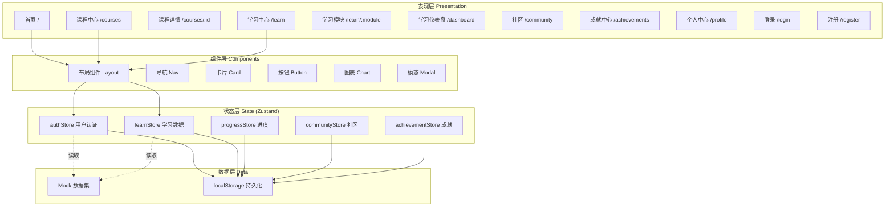
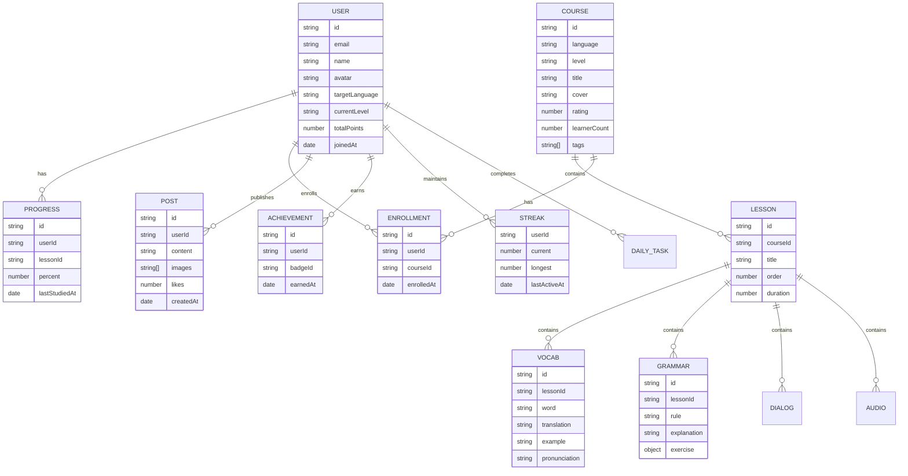

# 多语种在线教育平台 - 技术架构文档

## 1. 架构设计

本项目采用纯前端单页应用架构（SPA），使用 React + TypeScript + Vite 构建，使用 localStorage 持久化用户数据，无需后端即可演示完整功能闭环。



---

## 2. 技术栈描述

| 类别 | 选型 | 版本 | 用途 |
|------|------|------|------|
| 框架 | React | 18.3.x | UI 框架 |
| 语言 | TypeScript | 5.6.x | 类型安全 |
| 构建工具 | Vite | 5.4.x | 开发与构建 |
| 路由 | react-router-dom | 6.26.x | 客户端路由 |
| 状态管理 | zustand | 4.5.x | 全局状态 |
| 样式 | Tailwind CSS | 3.4.x | 原子化样式 |
| 图表 | recharts | 2.12.x | 雷达图、柱状图 |
| 图标 | lucide-react | 0.460.x | 线性图标 |
| 工具 | clsx | 2.1.x | 类名合并 |
| 持久化 | 自实现 + localStorage | - | 用户数据持久化 |

**包管理器**：npm（CI 环境默认）

---

## 3. 路由定义

| 路由 | 用途 | 鉴权 |
|------|------|------|
| `/` | 首页门户 | 公开 |
| `/courses` | 课程中心列表 | 公开 |
| `/courses/:id` | 课程详情 | 公开 |
| `/learn` | 学习中心入口 | 需登录 |
| `/learn/vocab` | 单词记忆训练 | 需登录 |
| `/learn/grammar` | 语法练习 | 需登录 |
| `/learn/speaking` | 口语跟读 | 需登录 |
| `/learn/listening` | 听力训练 | 需登录 |
| `/dashboard` | 学习仪表盘 | 需登录 |
| `/recommend` | 个性化推荐 | 需登录 |
| `/community` | 社区动态广场 | 公开 |
| `/community/group/:id` | 学习小组详情 | 需登录 |
| `/achievements` | 成就中心 | 需登录 |
| `/profile` | 个人中心 | 需登录 |
| `/login` | 登录 | 游客 |
| `/register` | 注册 | 游客 |
| `*` | 404 兜底 | 公开 |

---

## 4. 数据模型

### 4.1 核心数据模型（Mermaid ER）



### 4.2 数据持久化方案

所有用户相关数据写入 `localStorage`，键名规范：`linguaverse:user`、`linguaverse:progress` 等。首次访问自动注入 seed 数据，包含 12 门课程、200+ 单词、20 段对话、30 道语法题。

### 4.3 状态管理切片

| Store | 职责 |
|-------|------|
| `authStore` | 登录态、用户信息、目标语种 |
| `learnStore` | 训练模块进度、错题本、收藏 |
| `progressStore` | 课程进度、章节完成度 |
| `communityStore` | 社区动态、点赞、评论 |
| `achievementStore` | 徽章、积分、连胜、任务 |

---

## 5. 关键交互实现

### 5.1 单词记忆
闪卡正反面翻转 → 拼写测试 → 艾宾浩斯复习队列。状态由 `learnStore` 维护，复习算法：基于"忘记/认识/模糊"三档选择调度下次复习时间（演示用简化版：每张卡记录 0/1/2 难度，依次 1/3/7 天复习）。

### 5.2 口语跟读
使用 Web Audio API 录音 + 解析音量波形，与原音波形叠加对比；评分算法：基于音量匹配度 + 时长比例给 0-100 分（演示用简化版：随机波动模拟 AI 评分）。

### 5.3 听力训练
多档语速切换（0.75x/1.0x/1.25x）使用 `HTMLAudioElement.playbackRate`；听写填空实时校验；听后选择立即反馈。

### 5.4 个性化推荐
基于用户目标语种、当前等级、最近 7 天薄弱维度（词汇/语法/口语/听力）生成每日 30 分钟学习清单，存于 `recommendStore` 临时态。

---

## 6. 性能与体验

- 首屏关键资源内联 CSS 变量，避免 FOUC
- 路由切换使用 `<Suspense>` 边界 + 顶部进度条
- 图片使用占位渐变 + 文本标签，零外链请求
- 所有动效使用 CSS `transform` 与 `opacity`，GPU 加速
- 字体本地化：仅引入 2 个字符集子集，避免网络抖动

---

## 7. 项目结构

```
/workspace
├── .trae/documents/        # 需求与架构文档
├── public/                 # 静态资源
├── src/
│   ├── main.tsx            # 入口
│   ├── App.tsx             # 根组件 + 路由
│   ├── index.css           # 全局样式 + CSS 变量
│   ├── components/         # 通用组件
│   │   ├── layout/         # 布局类
│   │   ├── ui/             # 基础 UI
│   │   └── charts/         # 图表组件
│   ├── pages/              # 页面组件
│   │   ├── Home.tsx
│   │   ├── Courses.tsx
│   │   ├── CourseDetail.tsx
│   │   ├── Learn.tsx
│   │   ├── Vocab.tsx
│   │   ├── Grammar.tsx
│   │   ├── Speaking.tsx
│   │   ├── Listening.tsx
│   │   ├── Dashboard.tsx
│   │   ├── Recommend.tsx
│   │   ├── Community.tsx
│   │   ├── Achievements.tsx
│   │   ├── Profile.tsx
│   │   ├── Login.tsx
│   │   └── Register.tsx
│   ├── stores/             # Zustand stores
│   ├── data/               # Mock 数据
│   ├── hooks/              # 自定义 hooks
│   ├── utils/              # 工具函数
│   └── types/              # 全局类型
├── index.html
├── package.json
├── tsconfig.json
├── vite.config.ts
├── tailwind.config.js
└── postcss.config.js
```

---

## 8. 开发与运行

```bash
npm install
npm run dev      # 开发模式，端口 5173
npm run build    # 生产构建
npm run preview  # 预览构建结果
```
