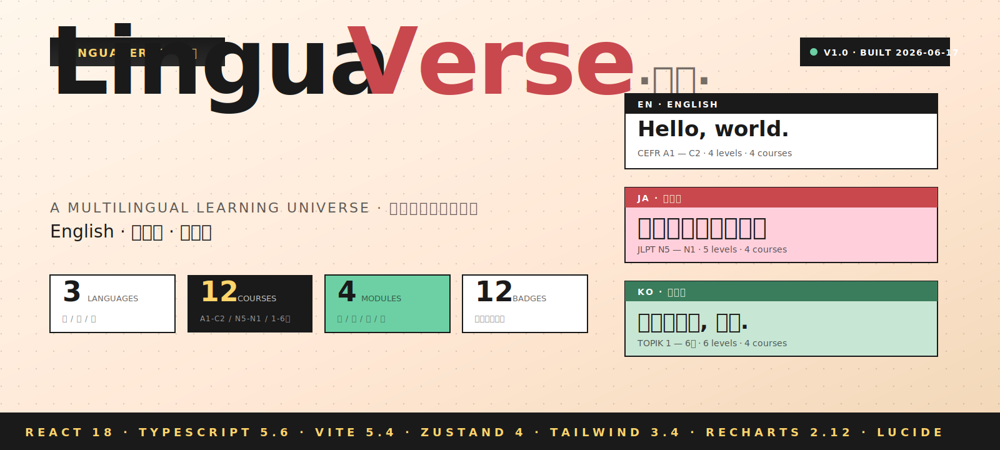
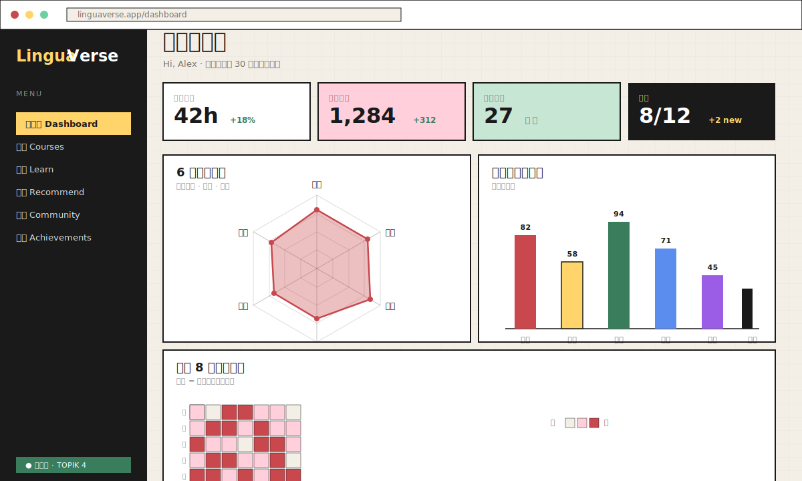
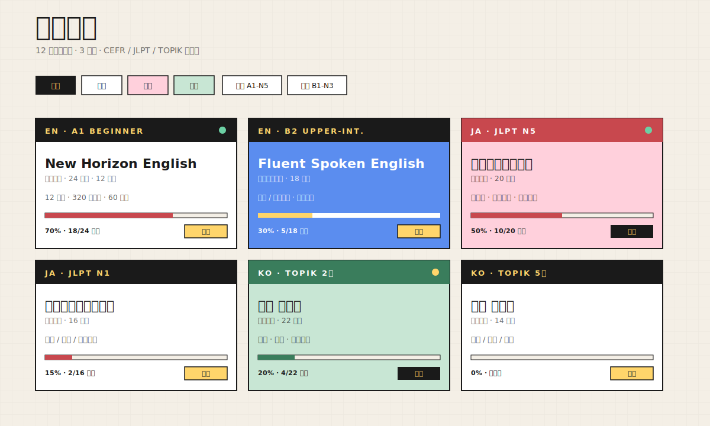
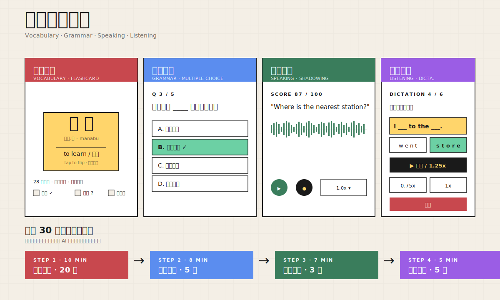
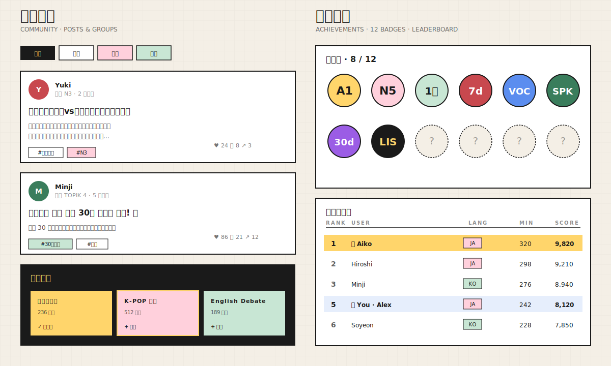

# LinguaVerse · 语元

> 沉浸式多语种学习平台 · English / 日本語 / 한국어
> CEFR A1–C2 · JLPT N5–N1 · TOPIK 1–6


<p align="center">
  
</p>

---

## 📸 界面预览

<table>
  <tr>
    <th>学习仪表盘 · Dashboard</th>
    <th>课程中心 · Courses</th>
  </tr>
  <tr>
    <td></td>
    <td></td>
  </tr>
  <tr>
    <th>互动学习模块 · Learning Modules</th>
    <th>社区 & 成就 · Community & Achievements</th>
  </tr>
  <tr>
    <td></td>
    <td></td>
  </tr>
</table>

---

## ✨ 核心特性

| 模块 | 说明 |
|------|------|
| **分级课程体系** | 12 门课程覆盖英语 CEFR A1–C2 / 日语 JLPT N5–N1 / 韩语 TOPIK 1–6 |
| **四大训练模块** | 单词记忆（闪卡 + 拼写）/ 语法练习（选择 + 错题解析）/ 口语跟读（AI 评分波形）/ 听力训练（多档语速） |
| **学习进度追踪** | 6 维能力雷达图 + 月度趋势 + 周柱状图 + 8 周热力日历 + 错题本 |
| **用户系统** | 邮箱注册登录 + 目标语种 / 等级偏好 |
| **个性化推荐** | 基于薄弱维度生成每日 30 分钟学习路径（10+8+7+5） |
| **社区生态** | 动态发布 / 点赞评论 / 学习小组（按语种筛选） |
| **成就激励** | 12 枚稀有徽章（自动解锁）+ 周排行榜 + 积分商城 |

---

## 🎨 设计语言

- **字体**：Fraunces 衬线展示体（标题） + Inter（UI） + Noto Sans SC / Noto Serif JP / Noto Serif KR（语种点缀）
- **配色**：深墨黑 `#0B0B0F` × 米白 `#F4F1EA` + 樱粉 / 翡翠青 / 琥珀金三语种文化色 + 霓虹渐变
- **元素**：巨幅衬线大标题、硬阴影按钮、切角 notched 卡片、噪点纹理、滚动字符背景、渐变文字、翻卡动画

---

## 🛠️ 技术栈

| 类别 | 选型 |
|------|------|
| 框架 | React 18.3 + TypeScript 5.6 |
| 构建 | Vite 5.4 |
| 路由 | React Router 6.26 |
| 状态 | Zustand 4.5（带 `persist` 中间件 → localStorage） |
| 样式 | Tailwind CSS 3.4 + 自定义 design tokens |
| 图表 | Recharts 2.12（雷达 / 柱状 / 面积 / 热力日历） |
| 图标 | Lucide React |
| 持久化 | localStorage（键名 `linguaverse:*`） |

---

## 📁 项目结构

```
linguaverse/
├── docs/
│   └── images/                 # README 配图（hero / dashboard / courses / modules / community）
├── public/                     # 静态资源
├── src/
│   ├── components/
│   │   ├── layout/             # Layout · Navbar · Footer
│   │   └── ui/                 # Button · Card · Badge · Progress
│   ├── pages/                  # 15 个页面
│   │   ├── Home.tsx            # 首页
│   │   ├── Courses.tsx         # 课程中心（筛选 + 卡片网格）
│   │   ├── CourseDetail.tsx    # 课程详情
│   │   ├── Learn.tsx           # 学习入口
│   │   ├── Vocab.tsx           # 单词记忆（闪卡 + 拼写）
│   │   ├── Grammar.tsx         # 语法练习
│   │   ├── Speaking.tsx        # 口语跟读
│   │   ├── Listening.tsx       # 听力训练
│   │   ├── Dashboard.tsx       # 学习仪表盘
│   │   ├── Recommend.tsx       # 个性化推荐
│   │   ├── Community.tsx       # 社区动态
│   │   ├── Achievements.tsx    # 成就激励
│   │   ├── Profile.tsx         # 个人中心
│   │   ├── Login.tsx · Register.tsx
│   │   └── NotFound.tsx
│   ├── stores/                 # Zustand stores
│   │   ├── authStore.ts        # 用户认证
│   │   ├── learnStore.ts       # 学习数据 + 徽章触发
│   │   └── communityStore.ts   # 社区
│   ├── data/mock.ts            # 12 课程 / 28 词 / 5 语法 / 12 徽章 / 6 帖子 / 6 小组 / 8 排行榜
│   ├── types/index.ts          # 全局类型
│   ├── utils/index.ts          # 工具函数
│   ├── App.tsx                 # 根组件 + 路由 + RequireAuth
│   ├── main.tsx                # 入口
│   └── index.css               # 全局样式（自定义滚动条、噪点纹理、动画）
├── .trae/documents/            # PRD + 技术架构文档
├── index.html
├── package.json
├── tsconfig.json
├── vite.config.ts
├── tailwind.config.js
└── README.md
```

---

## 🚀 快速开始

```bash
# 1. 克隆仓库
git clone https://github.com/tianxuhu/linguaverse.git
cd linguaverse

# 2. 安装依赖
npm install

# 3. 启动开发服务器 → http://localhost:5173
npm run dev

# 4. 生产构建
npm run build
npm run preview
```

> 推荐 Node ≥ 20。无需任何后端服务，开箱即用。

---

## 🧭 路由地图

| 路径 | 页面 | 是否鉴权 |
|------|------|---------|
| `/` | 首页 Home | ✗ |
| `/courses` | 课程中心 | ✗ |
| `/courses/:id` | 课程详情 | ✗ |
| `/learn` | 学习入口 | ✓ |
| `/learn/vocab` | 单词记忆 | ✓ |
| `/learn/grammar` | 语法练习 | ✓ |
| `/learn/speaking` | 口语跟读 | ✓ |
| `/learn/listening` | 听力训练 | ✓ |
| `/dashboard` | 学习仪表盘 | ✓ |
| `/recommend` | 个性化推荐 | ✓ |
| `/community` | 社区动态 | ✗ |
| `/achievements` | 成就激励 | ✗ |
| `/profile` | 个人中心 | ✓ |
| `/login` · `/register` | 登录注册 | ✗ |

未登录访问受保护路由会自动跳转到 `/login?redirect=...`。

---

## 📊 数据模型

```ts
type Language = 'en' | 'ja' | 'ko'
type Level = 'A1' | 'A2' | 'B1' | 'B2' | 'C1' | 'C2' | 'N5' | 'N4' | 'N3' | 'N2' | 'N1'
            | '1' | '2' | '3' | '4' | '5' | '6'

interface Course   { id, title, lang, level, lessons, cover, accent, ... }
interface VocabItem{ id, word, reading, meaning, example, courseId }
interface GrammarItem { id, prompt, choices[], answer, explain, courseId }
interface User     { id, name, email, targetLang, level, streak, totalMinutes, ... }
interface Badge    { id, code, name, desc, icon, color, condition }
```

完整类型与业务规则见 [TECHNICAL_ARCHITECTURE.md](.trae/documents/TECHNICAL_ARCHITECTURE.md)。

---

## 🏅 徽章系统

| Code | 名称 | 触发条件 |
|------|------|---------|
| `A1` | 入门登堂 | 完成任一 A1 课程 |
| `N5` | 五十音落 | 完成日语 N5 课程 |
| `1급` | 한국어 첫걸음 | 完成 TOPIK 1 课程 |
| `b4` | 声临其境 | 口语跟读平均分 ≥ 90 |
| `b5` | 语法通 | 语法测验全对 |
| `streak7` | 持之以恒 | 连续打卡 7 天 |
| `streak30` | 锲而不舍 | 连续打卡 30 天 |
| `vocab1000` | 词汇破千 | 累计学习 1000 词 |
| ... | ... | （共 12 枚） |

---

## 📄 文档

- 📘 [产品需求文档 PRD](.trae/documents/PRD.md)
- 📗 [技术架构文档](.trae/documents/TECHNICAL_ARCHITECTURE.md)

---

## 📜 License

[MIT](LICENSE) © 2026 LinguaVerse
